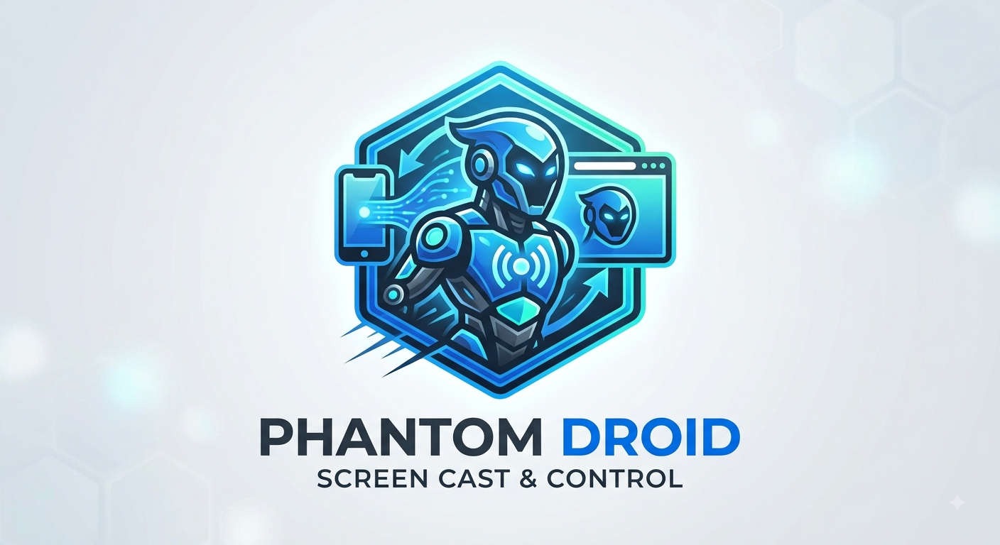

<p align="center">
  
</p>

<h1 align="center">Phantom Droid - Signaling Server</h1>

<p align="center">
  <a href="https://github.com/rakeshkumarg2119/Phantom-Droid/releases/download/v1.0.0/phantom-droid.apk">
    
  </a>
</p>

## Overview

This is the Python (FastAPI) backend that acts as the WebRTC Signaling Server for **Phantom Droid**. Its sole purpose is to connect the Android App to the React Web Portal by exchanging SDP offers/answers and ICE candidates. 

*No video or audio data passes through this server—it is purely for connection handshakes.*

## How to Run

Ensure you have Python installed.

```bash
# Create a virtual environment
python -m venv venv
venv\Scripts\activate

# Install dependencies
pip install -r requirements.txt

# Start the server
uvicorn main:app --host 0.0.0.0 --port 8000 --reload
```

The server will be available at `ws://localhost:8000/ws` for WebSocket signaling.
